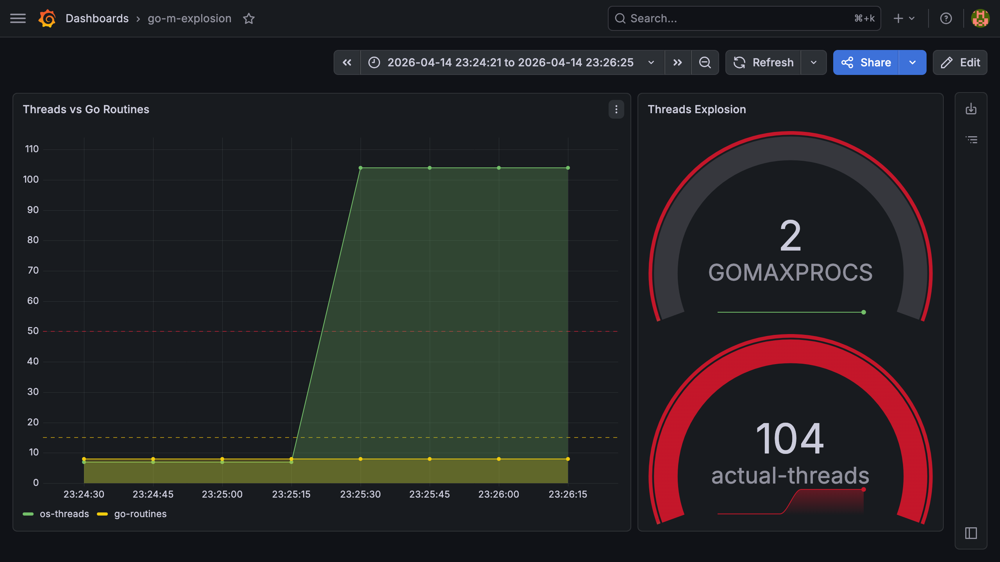
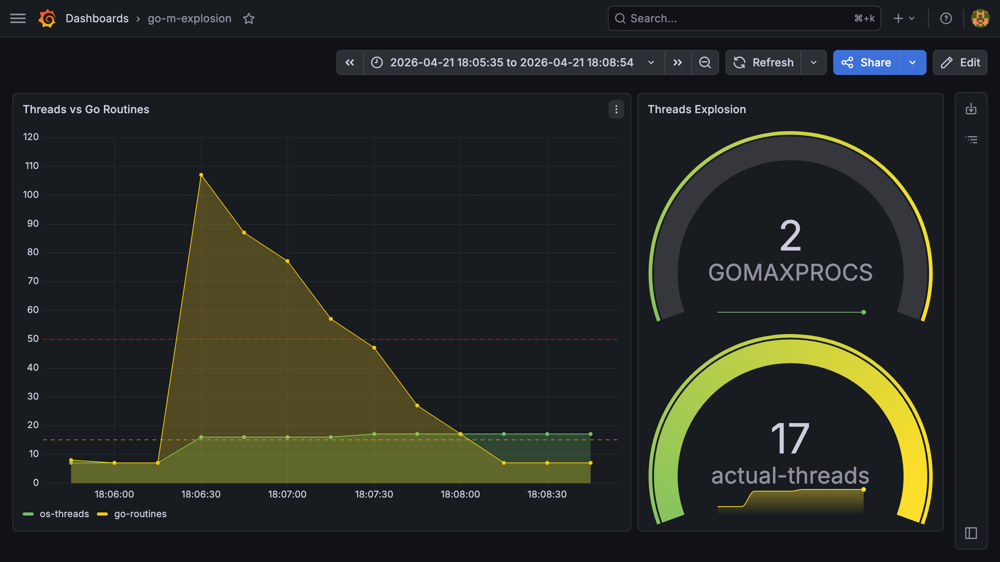

# Go Liveness Trap: Thread Explosion Analysis

[](https://goreportcard.com/report/github.com/yourusername/go-liveness-trap)
[](https://opensource.org/licenses/MIT)

## Overview

This project demonstrates a critical side-effect of the Go Runtime scheduler's design: **The Liveness Trap**.

While Go's `GOMAXPROCS` limits the number of goroutines executing simultaneously in user-space, the scheduler (`sysmon`) will bypass this limit and spawn an unbounded number of OS threads ($M$) when it detects blocking synchronous calls (e.g., CGO, slow I/O, or syscalls).

### The Core Thesis
The Go Runtime prioritizes **System Liveness** over **Resource Determinism**. In a high-load environment with blocking I/O, this can lead to a "Thread Explosion," causing extreme context-switching overhead and potential Denial of Service (DoS) on resource-constrained systems.

---

## Technical Architecture

The experiment uses a controlled environment to trigger and monitor the handoff mechanism:

* **Mechanism:** A fleet of 100 goroutines invoking a blocking C function (`sleep`).
* **Trigger:** Synchronous CGO calls that hide execution from the Go scheduler's cooperative preemption.
* **Observer:** `sysmon` detects that $P$ (Logical Processors) are stuck and performs a `retake`, spawning new $M$ (Machine Threads) to keep the application "alive."


---

## Observability Stack

The project includes a pre-configured monitoring stack to visualize the explosion in real-time:

* **Prometheus:** Scrapes Go runtime metrics every 1s (`scrape_interval: 1s`).
* **Grafana:** Provides a high-resolution dashboard comparing `GOMAXPROCS` vs. actual `go_threads`.

### Visual Proof: The Explosion Lifecycle

Below is a high-resolution Grafana capture showing the transition from an idle state to a thread explosion.

<p align="center">
  
</p>

**Key Observations on the Graph:**
1. **Baseline (Idle):** The thread count ($M$) stays strictly around `GOMAXPROCS` (2-5 threads).
2. **The Incident:** As soon as 100 blocking CGO calls are initiated, the scheduler loses control over $P$ resources.
3. **Explosion:** `sysmon` detects the blockage and forces the creation of new $M$ threads to maintain liveness, resulting in a vertical spike to ~105 threads.
4. **Recovery:** After the 10-second C-blocks expire, goroutines exit, and threads eventually return to the idle pool (though OS threads may persist for some time).
---

## Getting Started

### Prerequisites
* Docker & Docker Compose
* Go 1.26+
* CGO enabled (e.g., `gcc` or `clang` installed)

### Reproduction Steps

1.  **Spin up the monitoring stack:**
    ```bash
    docker-compose up -d
    ```

2.  **Run the experiment:**
    ```bash
    go run main.go
    ```

3.  **Analyze the results:**
    Open Grafana at [http://localhost:3000](http://localhost:3000) (Default login: `admin/admin`).
    Observe the `go_threads` metric skyrocketing as soon as the CGO calls begin.

---

## Key Findings

1.  **GOMAXPROCS is not a hard Thread Limit:** It only limits the number of $P$ (logical processors). The number of $M$ (OS threads) can reach the `schedretake` limits (default 10,000).
2.  **The Single-Core Danger:** On resource-constrained machines (e.g., Kubernetes pods with 1 CPU), spawning 100+ threads creates massive kernel-level context switching overhead.
3.  **CGO Transparency:** Synchronous CGO calls are opaque to the Go scheduler, forcing it to use the most aggressive thread-spawning strategy to maintain liveness.

---

## Proposed Solutions: 

### Cooperative Concurrency Control:

Move synchronization from the OS-level to the Go Runtime-level.

- **Mechanism**:Use a buffered channel or a semaphore to limit the number of goroutines allowed to enter the "CGO danger zone" simultaneously.
- **Behavior**: When the limit is reached, subsequent goroutines will call gopark and move to the synchronization object's wait queue.
- **Outcome**: *P* resources remain fluid. sysmon observes healthy *P* states, effectively capping the number of OS threads to *$M \approx GOMAXPROCS + Workers$*.

#### Semaphore solution:

- **Run the experiment**
```bash
   cd ./cmd/solutionsemaphore
   go run main.go
```

- **Graph**
The graph demonstrates that only the first $N$ goroutines are allowed to execute the slow_call concurrently. The remaining goroutines are parked in the channel's wait queue, consuming minimal memory and zero additional OS threads. Once a slot is released, the scheduler unparks the next goroutine

<p align="center">
  
</p>

---

## Conclusion

In high-performance systems (Fintech, HFT, Gateways), this behavior must be mitigated by:
* Using worker pools to limit concurrency at the application level.
* Offloading blocking tasks to asynchronous I/O where possible.
* Strict monitoring of `go_threads` with immediate alerting on deviations from `GOMAXPROCS`.

---

## License
MIT. Created for educational purposes in Go Systems Research.